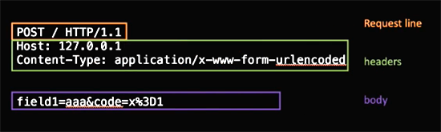
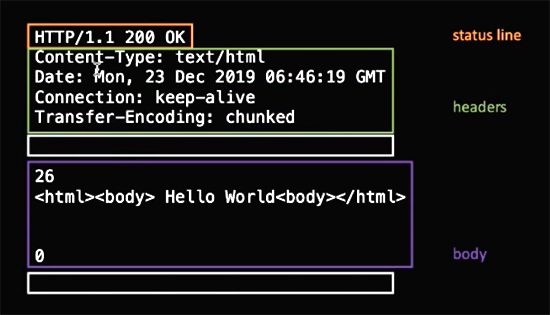

# 浏览器工作原理：总论与HTTP协议

## 浏览器
+ URL —> HTTP
+ HTML —> parse
+ DOM —> css compution
+ DOM with CSS —> layout
+ DOM with position —> render
+ Bitmap

### ISO-OSI七层网络模型
+ 应用/表示/会话 ——> HTTP
+ 传输 ——> TCP/UDP
+ 网络 ——> IP
+ 数据链路/物理 ——> 4G/5G/WIFI
> 浏览器在TCP层上面  
> 在node.js里，TCP层require包是net  
> require("net")  
> 在HTTP层如果要直接情求HTTP，则  
> require("http")  

### TCP与IP的一些基础知识
+ 流：TCP是可靠的流式传输 
+ 包：IP有包的概念
+ 端口：TCP层标识应用的
+ IP地址：IP用
+ require('net');在NODE里用的TCP的库
+ libnet/libpcap：IP层的在NODE里访问不到，只能用C++访问，libnet是构造IP包的库，libpcap是抓包的
> wireshark 抓IP包工具  
> Fiddler是windows上HTTP层的抓包，MAC可以用Charles

### HTTP
+ Request
  
+ Response  
  
> HTTP：一问一答，先问后答  
> TCP：全双工通道，服务端可以和客户端互发任何消息，TCP协议只保证发消息的顺序和到达情况，没有规定如客户端发了消息服务端一定要回消息

### HTTP标准
https://tools.ietf.org/html/rfc2616
#### 简易版Request：
+ Request line
    + method：OPTIONS/GET/POST……
    + path：/
    + HTTP/1.1
+ Headers
    + Content-Type  
        + application/x-www-form-urlencoded 默认的表单提交
        + multipart/form-data 表单里有文件
        + text/xml
        + application/json
+ body(和Headers隔着一个空行) 