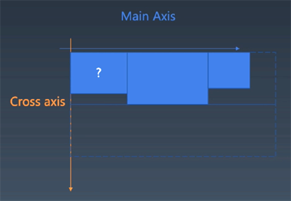

# 浏览器工作原理 layout排版

浏览器排版三代技术  
+ 正常流Normal Flow
  - display block/inline-block/inline  
  - position absolute/relative  
  - float, clear
+ flex 最简单实现的
  > https://developer.mozilla.org/en-US/docs/Glossary/Flex  
  > + flex-direction
  > + flex-wrap
  > + justify-content
  > + align-content

+ grid  
  > https://developer.mozilla.org/en-US/docs/Glossary/Grid  

## step1 确定主轴/交叉轴
  

flex-direction: row  
Main: width/x/left/right  
Cross: height/y/top/bottom

  

flex-direction: column     
Main: height/y/top/bottom  
Cross: width/x/left/right  

## step2 收集元素进行
+ 分行，跟mainSize属性有关
    + 根据主轴尺寸，把元素分进行  
    + 若设置了no-wrap，则强行分配进第一行

## step3 计算主轴
在flex布局里，可以先算所有元素的主轴方向的尺寸和位置，然后再计算交叉轴方向的位置和尺寸。

计算主轴方向
+ 找出所有Flex元素  
+ 把主轴方向的剩余尺寸按比例分配给这些元素  
+ 若剩余空间为负数，所有Flex元素为0，等比压缩剩余元素

## Step4 计算交叉轴

计算交叉轴方向
+ 根据每一行flexLine中最大元素尺寸计算行高
+ 根据行高flex-align和item-align，确定元素具体位置

# 浏览器工作原理 绘制
render  
composing  
draw（代码完成）  

绘制需要依赖一个图形环境，这里采用npm包images：  
npmjs.com/package/images

## Step 1 绘制单个元素
+ 绘制在一个viewport上进行
+ 与绘制相关属性
    + background-color
    + border
    + background-image

## Step2 绘制DOM 
