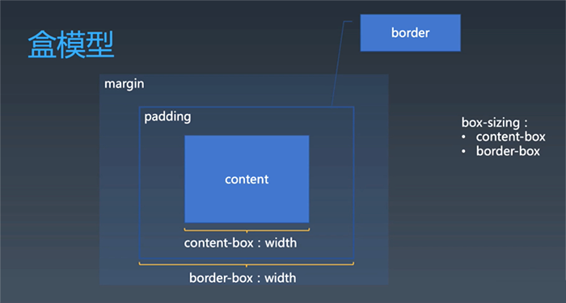
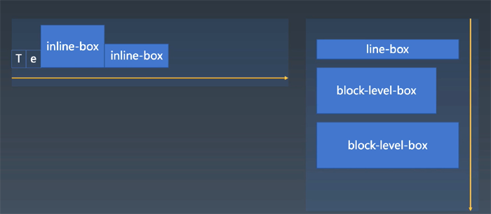
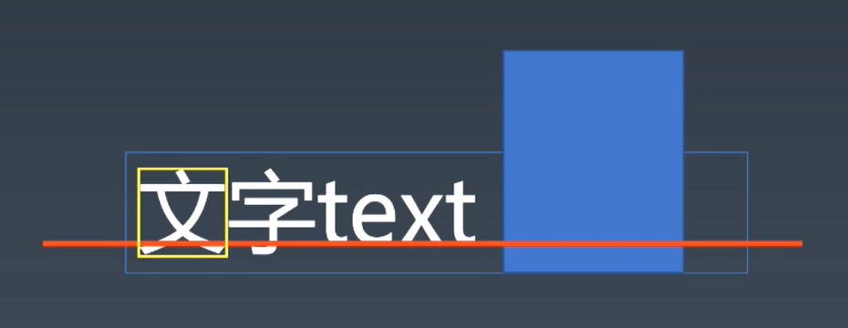

# CSS选择器

+  https://www.w3.org/TR/selectors-3/ 10.1Grammar
+  https://www.w3.org/TR/selectors-4/ （一般不参考）

## 选择器语法

### 简单选择器
+ \*
+ type selector  
  > div svg|a  
+ .cls
+ #id
+ [attr=value]
+ :hover
+ ::before

### 复合选择器compound
+ <简单选择器><简单选择器><简单选择器> , <——必须同时match这几个简单选择器
+ \* 或者 div 必须写在最前面，伪类/味元素必须写在最后面

### 复杂选择器
+ <复合选择器>\<sp><复合选择器> 
+ <复合选择器>">"<复合选择器>
+ <复合选择器>"~"<复合选择器>
+ <复合选择器>"+"<复合选择器>
+ <复合选择器>"||"<复合选择器>

### 选择器列表
+ comma

## 选择器优先级Specifications

+ 简单选择器计数  
  + 四元组 [inline, #id, .cls, type]
  + .cls， [attr=value]，:hover 同级
  +  type，::before 同级
  + *、combinator，不增加优先级
  + :not(x):声明:not()不增加优先级，但X增加
  ```
  #id div.a#id {
      //……
  }

  四元组 [0, 2, 1, 1]

  S = 0*N^3 + 2*N^2 + 1*N^1 + 1
  取N = 1000000
  S = 2000001000001
  ```

+ 相关资料
  + https://developer.mozilla.org/en-US/docs/Web/CSS/Specificity
  + https://specifishity.com/specifishity.pdf 
  + https://www.w3.org/wiki/Css/Training/Priority_level_of_selector
  + https://drafts.csswg.org/selectors-3/#specificity
  + https://www.w3.org/TR/selectors-4/#specificity-rules

```
一组练习：

div#a.b .c[id=x]
优先级：[0, 1, 3, 1]

#a:not(#b)
优先级：[0, 2, 0, 0]
说明：not伪类不参与优先级计算，但:not(x)的X参与

*.a
优先级：[0, 0, 1, 0]
说明：* 不影响优先级

div.a
优先级：[0, 0, 1, 1]
```

### 伪类

#### 链接/行为
+ :any-link
  > :link是没有访问过的链接，不是所有链接，因为发现没有表示所有链接的伪类，所以加了any-link
+ :link :visited
+ :hover
+ :active
+ :focus
  > 扩展：操作系统焦点系统/tab切焦点/可访问性
+ :target


#### 树结构
+ :empty
+ :nth-child()
+ :nth-last-child()
+ :first-child :last-child :only-child
> 在toy browser中computeCSS是在startTag后调用（layout在endTag后）  
> 伪类:nth-last-child()，:last-child，:only-child是实现不了的，需要CSS回溯的，___不推荐用，浏览器即使实现，代码也会非常复杂，并且影响重排次数___


#### 逻辑型
+ :not伪类
+ :where :has


### 伪元素

+ ::before
+ ::after
> 无中生有伪元素：本来这地方没有，硬生生的塞进去一个元素
```
<div>
<::before/>
content content content content
content content content content
content content content content
content content content content
content content content content
content content content content
<::after/>
</div>
```

+ ::firstLine
+ ::firstletter
> 本来有东西，给框起来的伪元素
```
<div>
<::first-letter>c</::first-letter>ontent content content content
content content content content
content content content content
content content content content
content content content content
</div>
```

可用属性
+ first-line
    + font系列
    + color系列
    + background系列
    + word-spacing
    + letter-spacing
    + text-decoration
    + text-transform
    + line-height 
+ first-letter
    + font系列
    + color系列
    + background系列
    + text-decoration
    + text-transform
    + letter-spacing
    + word-spacing
    + line-height
    + float
    + vertical-align
    + 盒模型系列：margin, padding, border

思考：为什么first-letter可以设置float之类的，而first-line不行？  
因为如果给first-line设置float，则first-line脱离文档流出去，就不是第一行了，然后自动选择剩下的第一行，然后无限循环下去。  

如果first-line改字体，内容也会改变（影响字宽间距等），也不是原来的first-line了，为什么first-line可以改字体呢？  
因为文字是一个个的，从前面开始渲染的。first-line实现机制是把属性应用到文字上  


***


# CSS属性——排版

## 盒（Box）
CSS排版基本就是“盒”和“文字”  

+ 源代码 —— 标签Tag
+ 语义 —— 元素Element
+ 表现 —— 盒Box
  
> + HTML代码中可以书写开始<kbd>标签</kbd>，结束<kbd>标签</kbd>，和自封闭<kbd>标签</kbd>。
> 
> + 一对起止<kbd>标签</kbd>，表示一个<kbd>元素</kbd>。
>
> + DOM树中存储的是<kbd>元素</kbd>和其他类型的节点（Node，如文本节点、注释节点、DOCTYPE、process instruction等）。
> 
> + CSS选择器选中的是<kbd>元素</kbd>。
> 
> + CSS选择器选中的<kbd>元素</kbd>，在排版时可能产生多个<kbd>盒</kbd>。如inline元素大部分情况会产生多个盒；如有伪元素的情况，一个元素带两个伪元素
> 
> + 排版和渲染的基本单位是<kbd>盒</kbd>。


## 盒模型
    

+ padding 边距
+ margin 留白
+ box-sizing
    + content-box，CSS中的width在现代浏览器里默认表示的是content-width
    + border-box 

很多概念是从排版来的，margin在排版中一般是指图片周围的留白；padding在书籍排版里是页边距的概念，报纸中的padding就相当于区块间的padding

## 排版的第一代：正常流 Normal Flow

如何写字？  
+ 从左到右书写
+ 同一行写的文字都是对齐的
    + 中文是格子
    + 英文是四道线，从上往下第三条线是baseline 
+ 一行写满了，就换到下一行b


### 正常流排版
+ 收集盒和文字进行
+ 计算盒和文字在每一行中的排布
    + 左右排布
    + 上下排布
+ 计算行的排布
    + 在行内排布中把行高算出来，然后把行依次放
    + 有些元素直接占整行，如block-level元素

  

注：一堆文字排满一行，就产生一个行盒，但是这个行盒是不对应于任何元素的，这种行盒就是所谓的inline元素会产生多个盒的原理。  

伪元素firstline实际上就是第一个行盒里的内容，所以排版的时候也可以把这种生成的行盒当做一个虚拟元素，行盒是先被生成出来的空的，这样伪元素的属性都可以被加到这一行上。 

行盒line-box会跟block-box一起排

+ inline-formatting-context，IFC
+ block-formatting-context，BFC


#### 正常流的行模型：IFC

  

文字混排：
+ 文字混排文字本身占据的空间
+ 文字之间对齐的关系
+ 行内的盒跟文字的对齐关系
+ 行高

baseline：
+ 中文无基线
+ 其他文字通过基线对齐，如text下缘对齐，但baseline并不是文字真正的下边缘，也不是行底
+ 英文练习本四根线，从上往下第三根线是基线，第二根是与基线在沿着行中心方向对称的一条线，可以帮助写e,x,a等时，找到文字的顶端。计算机里的排版只有baseline，没有上面一条线和其他辅助线。

文字上缘与下缘
+ 中文字上顶上缘，下抵下缘（黄色方框范围）
+ 根据行高，有行内边距
+ vertical-line属性可以用到这几个值去对齐，

> inline-block只用建议只用vertical-align:bottom/top/middle之一,
不要用text-top/bottom/baseline（因为这几个的对齐值是很直观的，其他几个会受到字体影响，可控性不如这三个）
  + vertical-align:baseline，是拿自己的baseline去对其行的baseline
  + vertical-align:top/bottom/middle，是拿自己的“顶部”“底部”“中线”去对其行的“顶部”“底部”“中线”
  + vertical-align:text-top/bottom，是拿自己的“顶部”“底部”去对齐行的text-top和text-bottom线


#### 正常流三大魔王之 float与clear

+ float先在原位渲染一个块级元素，再顶到float的方向去
+ float脱离了文档流的意思
+ float最初是排版领域的绕排，在文字之间排一个block
+ 由于inline-block不好用，所以有时候用float代替正常流换行用，做layout
+ 建议将float回归原本，实现海量文字绕排时用float，不要用来做正常布局
+ float会导致重排，但是重排范围很小，不影响大性能


#### 正常流三大魔王之 margin折叠

 margin折叠只会发生在BFC里
 + inline-box没有margin折叠
 + 所有的float元素没有margin折叠
 + margin折叠只会发生在BFC里，只会发生在BFC规定的方向（一般是上下方向）
 + 不同的BFC之间没有margin折叠

 BFC:  
 https://www.w3.org/TR/2011/REC-CSS2-20110607/visuren.html#block-formatting

 + 正常流里的容器并且overflow:visible不会产生BFC，其他能容纳正常流的都产生BFC
 + overflow:visible的会和外面和父亲正常流合并
 + disply:flex不是BFC，但是每个flex items是BFC

 9.2.1. Block-level elements and block boxes  
 Block Container：里面可以容纳block的东西
 Block-level Box：可以放进正常流里的东西  
 Block Box：里外都是block的东西

__总结：__
+ block-level 表示可以被放入bfc  
+ block-container 表示可以容纳bfc  
+ block-box = block-level + block-container  
+ block-box 如果 overflow 是 visible， 那么就跟父bfc合并  


#### 正常流三大魔王之 overflow:visible与BFC


## 排版的第二代：Flex 
https://www.w3.org/TR/2018/CR-css-flexbox-1-20181119/#flex-items

### Flex排版
+ 收集盒进行
+ 计算盒在主轴方向的排布
+ 计算盒在交叉轴方向的排布

分行  
+ 根据主轴尺寸，把元素分进行  
+ 若设置了no-wrap，则强行分配进第一行

计算主轴方向
+ 找出所有Flex元素
+ 把主轴方向的剩余尺寸按比例分配给这些元素
+ 若剩余空间为负数，所有flex元素为0，等比压缩剩余元素

计算交叉轴方向
+ 根据每一行中最大元素尺寸计算行高
+ 根据行高flex-align和item-align，确定元素具体位置