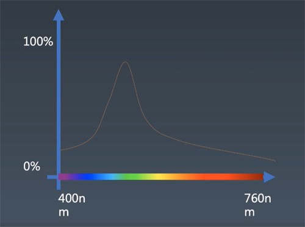
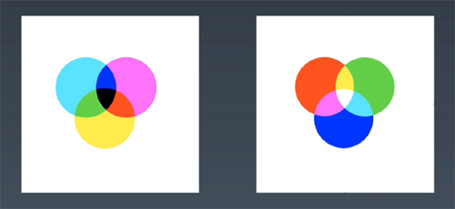

# CSS动画与绘制

+  https://www.w3.org/TR/selectors-3/ 10.1Grammar
+  https://www.w3.org/TR/selectors-4/ （一般不参考）

## Animation

+ @keyframes定义
+ animation：使用
```
@keyframes mykf
{
    from {background: red;}
    to {background: yellow;}
}

div
{
    animation:mykf 5s infinite;
}
```

## Animation属性

+ animation-name 时间曲线
+ animation-duration 动画的时长
+ animation-timing-function 动画的时间曲线
+ animaiton-delay 动画开始前的延迟
+ animation-iteration-count 动画的播放次数
+ animation-direction 动画的方向

```
@keyframes myky {
    0% {top:0; transition:top ease}
    50% {top:30px;transition:top ease-in}
    75% {top:10px;transition:top ease-out}
    100% {top:0; transition:top linear}
}
```

## Transition
transition 使用  
https://developer.mozilla.org/en-US/docs/Web/CSS/transition

+ transition-property 要变换的属性
+ transition-duration 变换的时长
+ transition-timing-function 时间曲线
+ transition-delay 延迟

## timing-function：cubic-bezier
CSS里只允许用三次贝塞尔曲线定义  
https://cubic-bezier.com/#.17,.67,.83,.67

+ 推荐所有位移类的曲线都用ease曲线
+ ease-in适合退出型动画，缓慢启动，然后快速退出
+ ease-out适合进入型动画，高速进画面，然后逐渐停留在一个位置

贝塞尔曲线的应用场景：拟合

> TIP:
> 性能上来说transform动画比较好（transform跟启动GPU相关的属性）  
https://developer.mozilla.org/en-US/docs/Web/CSS/transform

will-change  是与composition合成相关的属性
https://developer.mozilla.org/en-US/docs/Web/CSS/will-change


# CSS渲染与颜色

> WebGL  
https://webglfundamentals.org/

渲染：颜色和形状

## 颜色



### CMYK与RGB



CMYK：Cyanogen青，magenta品红，yellow黄，K黑，用于印刷行业

### 色相HSL与HSV


## 形状

+ border
+ box-shadow
+ border-radius

这些属性都会改变div的形状，进而形成需要去绘制的图形。这些图形在定义的时候定义成矢量图，在绘制的时候通过类似VUE的shader去绘成位图。这个过程在有些资料里被称为光栅化或栅格化或像素化。

用图形的时候建议用：
+ data uri + svg（svg是现行的最好的矢量图标准）
+ data:image/svg+xml,<svg width="100%" height="100%" version="1.1" xmlns="http://www.w3.org/2000/svg"> <ellipse cx="300" cy="150" rx="200" ry="80" style="fill:rgb(200,100,50);stroke:rgb(0,0,100);stroke-width:2" /></svg>


伪元素是在computeCSS里出来的