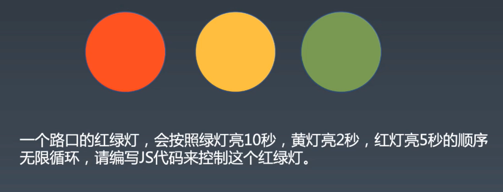

# 异步编程

async/await回顾

## 红绿灯问题



一个路口的红绿灯，会按照绿灯亮10秒，黄灯亮2秒，红灯亮5秒的顺序无限循环。用JS代码来控制这个红绿灯

+ 古早时期，只有setTimeout，按照时间差的做法

```
//不嵌套的setTimeout
function go(){
    green()
    setTimeout(yellow, 10000);
    setTimeout(red, 12000);
    setTimeout(go, 17000)
 }


//嵌套的setTimeout，使用递归
function go2(){
    green()
    setTimeout(function(){
        yellow()
        setTimeout(function(){
            red()
            setTimeout(function(){
                go()
            }, 5000);
        }, 2000);
    }, 10000);
}
```

+ promise用链式表达代替callback hell这种深度递归，但本质上没有改进
```
function sleep(t) {
    return new Promise((resolve, reject)=> {
        setTimeout(resolve, t);
    })
}

function go(){
    green()
    sleep(1000).then(() => {
        yellow();
        return sleep(200);
    }).then(() => {
        red();
        return sleep(500);
    }).then(go)
}
```

+ async/await，把promise当普通函数调
```
function sleep(t) { 
    return new Promise((resolve, reject)=> {
        setTimeout(resolve, t);
    })
}

async function go(){
    while(true) {
        green();
        await sleep(10000);
        yellow();
        await sleep(2000);
        red();
        await sleep(5000);
    }
}
```

+ 把自动控制换成点击按钮手动控制
```
function happen(element, eventName){
    return new Promise((resolve, reject)=> {
        element.addEventListener(eventName, resolve, {once:true});
    })
}

async function go(){
    while(true) {
        green();
        await happen(document.getElementById('next'), 'click');
        yellow();
        await happen(document.getElementById('next'), 'click');
        red();
        await happen(document.getElementById('next'), 'click');
    }
}
```

+ generator与异步没有关系，但是有中断函数执行的效果
```
function* go(){
    while(true){
        green();
        yield sleep(1000)
        yellow();
        yield sleep(200)
        red();
        yield sleep(500)
    }
}
    
function run(iterator){
    let {value, done} = iterator.next();
    if(done)
        return;
    if(value instanceof Promise)    
        value.then(() => {
            run(iterator)
        })
}
    

function co(generator){
    return function(){
        return run(generator());
    }
}

go = co(go);
```