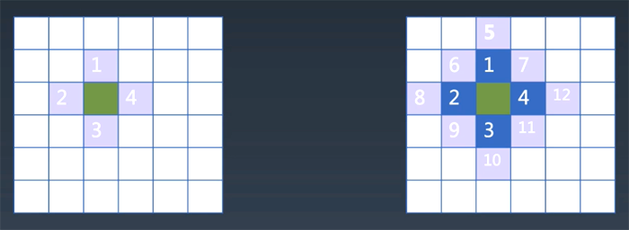

# 异步编程

async/await回顾

## 红绿灯问题


一个路口的红绿灯，会按照绿灯亮10秒，黄灯亮2秒，红灯亮5秒的顺序无限循环。用JS代码来控制这个红绿灯

+ 古早时期，只有setTimeout，按照时间差的做法

```
//不嵌套的setTimeout
function go(){
    green()
    setTimeout(yellow, 10000);
    setTimeout(red, 12000);
    setTimeout(go, 17000)
 }


//嵌套的setTimeout，使用递归
function go2(){
    green()
    setTimeout(function(){
        yellow()
        setTimeout(function(){
            red()
            setTimeout(function(){
                go()
            }, 5000);
        }, 2000);
    }, 10000);
}
```

+ promise用链式表达代替callback hell这种深度递归，但本质上没有改进
```
function sleep(t) {
    return new Promise((resolve, reject)=> {
        setTimeout(resolve, t);
    })
}

function go(){
    green()
    sleep(1000).then(() => {
        yellow();
        return sleep(200);
    }).then(() => {
        red();
        return sleep(500);
    }).then(go)
}
```

+ async/await，把promise当普通函数调
```
function sleep(t) { 
    return new Promise((resolve, reject)=> {
        setTimeout(resolve, t);
    })
}

async function go(){
    while(true) {
        green();
        await sleep(10000);
        yellow();
        await sleep(2000);
        red();
        await sleep(5000);
    }
}
```

+ 把自动控制换成点击按钮手动控制
```
function happen(element, eventName){
    return new Promise((resolve, reject)=> {
        element.addEventListener(eventName, resolve, {once:true});
    })
}

async function go(){
    while(true) {
        green();
        await happen(document.getElementById('next'), 'click');
        yellow();
        await happen(document.getElementById('next'), 'click');
        red();
        await happen(document.getElementById('next'), 'click');
    }
}
```

+ generator与异步没有关系，但是有中断函数执行的效果
```
function* go(){
    while(true){
        green();
        yield sleep(1000)
        yellow();
        yield sleep(200)
        red();
        yield sleep(500)
    }
}
    
function run(iterator){
    let {value, done} = iterator.next();
    if(done)
        return;
    if(value instanceof Promise)    
        value.then(() => {
            run(iterator)
        })
}
    

function co(generator){
    return function(){
        return run(generator());
    }
}

go = co(go);
```


# 寻路问题



## Step 1 准备地图编辑器

1.1、画出100*100的盘子：一维数组

```
<style>
    .cell {
        display:inline-block;
        width:6px;
        height:6px;
        background-color: gray;
        border-bottom:solid 1px white;
        border-right:solid 1px white;
        vertical-align: middle;
    }
    #container{
        width:701px;
    }
</style>

<div id="container"></div>

<script>
    var map = new Array(10000).fill(0);
    let container = document.getElementById("container");
    for(let y = 0; y < 100; y++) {
        for(let x = 0; x < 100; x++) {
            let cell = document.createElement("div");
            cell.classList.add("cell");
        container.appendChild(cell);
        }
    }
</script>
```

1.2、能在上面画线：在mousedown和mouseup置一个标志位，常年监听cell上的mousemove事件（或mouseover）

```
<script>
    var map = new Array(10000).fill(0);
    let container = document.getElementById("container");

    for(let y = 0; y < 100; y++) {
        for(let x = 0; x < 100; x++) {
            let cell = document.createElement("div");
            cell.classList.add("cell");
            cell.addEventListener("mousemove", () => {
                if(mouse)
                    cell.style.backgroundColor = 'black';
            })

        container.appendChild(cell);
        }
    }

    let mouse = false;

    document.addEventListener('mousedown', ()=> mouse = true)
    document.addEventListener('mouseup', ()=> mouse = false)
   
</script>
```

1.3、画错了能蹭掉：规定鼠标右键事件是橡皮擦

```
<script>
    var map = new Array(10000).fill(0);
    let container = document.getElementById("container");

    for(let y = 0; y < 100; y++) {
        for(let x = 0; x < 100; x++) {
            let cell = document.createElement("div");
            cell.classList.add("cell");

            cell.addEventListener("mouseover", () => {
                if(mouse) {
                    if(clear) {
                        cell.style.backgroundColor = '';  //只是改样式
                        map[y * 100 + x] = 0;  //真正改map状态
                    } else {
                        cell.style.backgroundColor = 'black';
                        map[y * 100 + x] = 1;
                    }
                }
                    
            })

        container.appendChild(cell);
        }
    }

    let mouse = false;
    let clear = false;

    document.addEventListener('mousedown', e => { //判断是右键则橡皮擦
        mouse = true
        clear = (e.which === 3);  //一般鼠标三个键，右键是3，中间滚轮是2
    })
    document.addEventListener('mouseup', ()=> mouse = false)

    document.addEventListener('contextmenu', e => e.preventDefault()) //禁掉右键菜单contextmenu
   
</script>
```

1.4、能保存地图，即保存后刷新还在：存到localStorage，并使用之

```
代码：Step1.MapEditor.html

删除地图：
delete localStorage.map
```

## Step 2 一个寻路算法（广度优先）

给一个起点和一个终点，看从起点到终点是否有一条路径走过去

+ 起点的上下左右的点可以找到，这些点的上下左右也可以找到
+ 不走回头路，走过的点要标记
+ 一直到走到的点包含终点，就完成了寻路
+ 广度优先搜索，深度优先搜索

使用队列queue存走过的路径，每一个点找到上下左右的点，然后展开

```
function findPath(map, start, end) {
    let queue = [start]; //使用一个队列，存走过的路径。先把start先放进去

    map = map.slice(); // 为了给已经走过的点标识，又不想污染原MAP，就slice一个新MAP

    function insert([x, y]) {
        if(map[100 * y + x] !== 0)  //遇到有障碍，走不了
            return;
        if(x < 0 || y < 0 || x >= 100 || y >= 100)  //如果到了棋盘边界，走不了
            return;
        map[100 * y + x] = 2;
        queue.push([x, y])
    }

    while(stack.length) { //每次循环，展开一个格，即找到上下左右
        let [x, y] = queue.shift();  //pop和unshift / push和shift
        console.log(x, y);
        if(x === end[0] && y === end[1])
            return true;
        insert([x - 1, y]);
        insert([x + 1, y]);
        insert([x, y - 1]);
        insert([x, y + 1]);
    }
    return false;
}
```

## Step 3 可视化路径

没有办法看到路径，不能检查是否正确。可以引入可视化的手段
```
function sleep(t) {
    return new Promise(function(resolve){
        setTimeout(resolve, t);
    });
}

findPath的函数改成async/await
```

深度优先算法：把queue改成stack,shift改成pop
```
async function findPath(map, start, end) {
    let stack = [start]; 

    map = map.slice(); 

    async function insert([x, y]) {
        if(map[100 * y + x] !== 0) 
            return;
        if(x < 0 || y < 0 || x >= 100 || y >= 100)  
            return;
        map[100 * y + x] = 2;
        container.children[y * 100 + x].style.backgroundColor = "lightgreen"; 
        await sleep(5);
        stack.push([x, y])
    }

    while(queue.length) { 
        let [x, y] = stack.pop(); //深度优先，shift改成pop
        console.log(x, y);
        if(x === end[0] && y === end[1])
            return true;
        await insert([x - 1, y]);
        await insert([x + 1, y]);
        await insert([x, y - 1]);
        await insert([x, y + 1]);
    }
    return false;
}
```

## Step 4 找到这条路径

使用当前点的前一个点pre，这样每个点是怎么来的就记录到map.slice上

## Step 5 A*启发式搜索

```
class Sorted {  //无序数组  找到启发式搜索的搜索顺序
    constructor(data, compare) {
        this.data = data;
        this.compare = compare;
    }
    take() {  //取数组里最小的，时间复杂度O(n),排序复杂度nlogn
        if(!this.data.length)
            return;
        let min = this.data[0];
        let minIndex = 0;
        for(let i = 1; i < this.data.length; i++) {
            if(this.compare(this.data[i], min) < 0) {
                min = this.data[i];
                minIndex = i;
            }
        }
        this.data[minIndex] = this.data[this.data.length - 1];
        this.data.pop();
        return min;
    }
    insert(v) {
        this.data.push(v);
    }
    get length() {
        return this.data.length;
    }
}
```