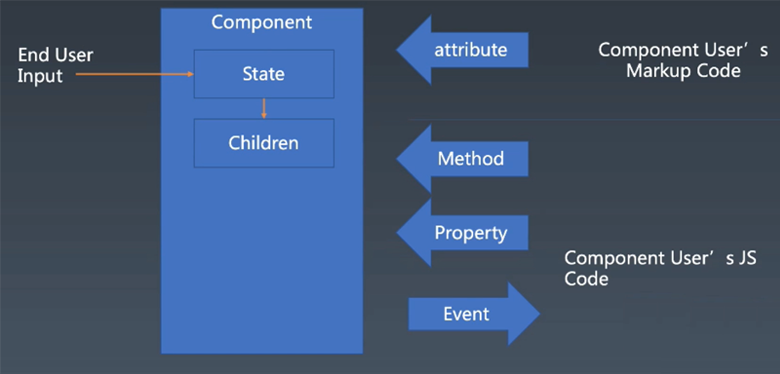
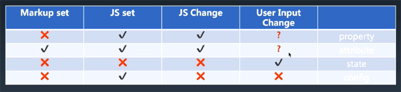
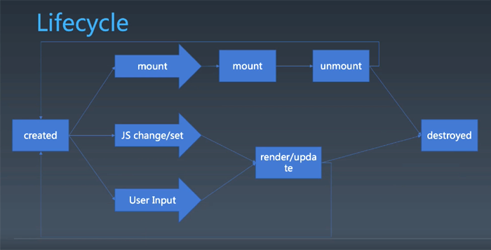

# Proxy

https://developer.mozilla.org/en-US/docs/Web/JavaScript/Reference/Global_Objects/Proxy  

+ 不是用来做业务的，使用不慎会让代码变得不可控，设置属性不是设置属性，获取原型不是获取原型，几乎可把所有对象的行为改变。
是给库的设计者和框架的设计者专用的语言功能。

```
let object = {
    a: 1,
    b: 2
}

let proxy = new Proxy(object, {
    get(obj, prop){
        console.log(obj, prop);
        return obj[prop];
    }
})

proxy.a
```

上例中，proxy相当于object的代理，跟直接使用object相比，提供各种各样勾子hook属性，不管对proxy做什么操作，都可以有一个hook
+ handler.apply
+ handler.construct
+ handler.defineProperty

```
let object = {
    a: 1,
    b: 2
}

let proxy = new Proxy(object, {
    get(obj, prop){
        console.log(obj, prop);
        return obj[prop];
    }
    defineProperty(obj, prop, desc){
        console.log(arguments);
        return Object.defineProperty(obj, prop, desc)
    }
})

Object.defineProperty(proxy, "a", {value:10})
//可以调进回调
```

https://github.com/vuejs/vue-next/blob/master/packages/reactivity/__tests__/effect.spec.ts 

effect(() => (dummy = counter.num))
reactive，VUE实现双向绑定的基础


# 组件化基础

## 对象与组件

### 对象
+ Properties
+ Methods
+ Inherit

### 组件 Component
+ Properties
+ Methods
+ Inherit
+ Attribute
+ Config & State
+ Event
+ Lifecycle
+ Children



+ State，一般只收到终端用户输入的改变，如tab的state事切到哪个tab
+ attribute/Method/Property/Evnet是组件使用者和组件作者之间的交互的方式
+ 组件使用者Component User有时候会写标记语言，如JSX，HTML…这些语言里设置的东西是attibute，一般attibute只允许字符串

### Attribute
Attribute vs Property ：

__概念上__

+ Attribute 强调描述性，如这个人帅不帅，外部的感觉
+ Property (财产)强调从属关系，如按钮有一个property，即这个property的所有权是属于这个对象的

__语言上__

+ Attribute
    ```
    <my-component attribute = "v" />
    myComponent.getAttribute( "a" )
    myComponent.setAttribute( "a", "value" );
    ```

+ Property
    ```
    myComponent.a = "value" ; 
    ```

Property是不能在HTML里改的，只有Attribute可以改，Attribute也可以在JS中通过get/set Attribute更改

特例，Attribute和Property很多时候在HTML和JS里概念完全重叠
+ id的attribute和property一样，但是名字不一样，attribute叫class，而JS里property叫className和classList

```
<div class="cls1 cls2"></div>
<script>
    var div = document.getElementByTagName( 'div' );
    div.className // cls1 cls2
</script>
```

+ style在attribute里是分号分隔的冒号键值对；在JS里是style对象。语义相同，但调用方式完全不一样

```
<div class="cls1 cls2" style="color:blue"></div>
<script>
    var div = document.getElementByTagName('div');
    div.style // 对象
</script>
```

+ href在property是resolve的结果，加上http，相对路径变成绝对路径；用getAttribute取出来就是跟html里一模一样

```
<a href="//m.taobao.com" ></div>
<script>
    var a = document.getElementByTagName('a');
    a.href // "http://m.taobao.com",这个URL是resolve过的结果
    a.getAttribute('href') // "//m.taobao.com"，跟HTML代码中完全一致
</script>
```

+ input的value的Attribute和Property很容易混，乍一看两者等效，但是是一种单向的同步关系

```
<input value = "cute" />
<script>
    var input = document.getElementByTagName('input'); // 若property没有设置，则结果是attribute
    input.value // cute
    input.getAttribute('value'); // cute
    input.value = 'hello' ; // 若value属性已经设置，则attribute不变，property变化，元素上实际的效果是property优先
    input.value // hello
    input.getAttribute('value'); //cute
</script>
```

## 如何设计组件




## Lifecycle

组件从创建created到销毁destroyed会做一些别的事情



+ mount/ummount
+ JS change/set，对于react有一个render方法
+ User Input可能发生状态变化


## Children
content型Children与Template型Children
```
<my-button>{{title}}</my-button>
<my-list>
    <li>{{title}}</li>
</my-list>
```

以m.taobao.com的轮播图为例，设计组件Carousel
```
Carousel

    state
        activeIndex
    property
        loop time imglist autoplay color forward
    attribute
        startIndex loop time imglist color forward
    children
        2种风格
        append remove add
    event
        change click hover swipe (resize) doubleclick   
    method
        next() prev() goto()
        play()/stop()和autoplay二选一
    config
        mode: "useRAF","useTimeout"

```