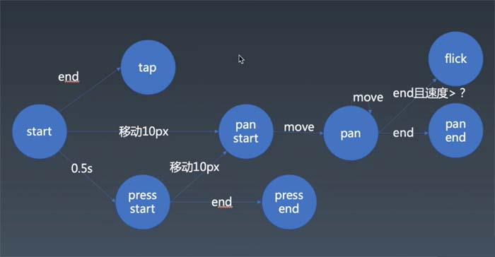

# 手势 Gesture

手淘轮播组件需求进一步研究：
+ 点击跳转问题
+ 拖拽行为
+ 移动兼容问题  
https://developer.mozilla.org/en-US/docs/Web/API/TouchEvent
    + mousedown
    + mousemove
    + mouseup
    + touchstart
    + touchmove
    + touchend
    + touchcancel


## 手势介绍

+ Tap：轻触
+ Pan：较慢的用手拖拽
+ Flick：快速拖拽，并立刻离开屏幕（划）
+ Press：长按

touch事件有天然的目标锁定的能力
+ touchstart
+ touchmove
+ touchend
+ touchcancel：和touchend只会触发一个
touch中changetouch——identifier


### Step1 监听器
```
//鼠标事件监听抽象
let element = document.body;

element.addEventListener("mousedown", (event) =>{
    start(event);
    let mousemove = event => {
        move(event);
    }
    let mouseend = event => {
        end(event);
        document.removeEventListener("mousemove", mousemove);
        document.removeEventListener("mouseup", mouseend);
    }
    document.addEventListener("mousemove", mousemove);
    document.addEventListener("mouseup", mouseend);
})


//监听touchEvent抽象
element.addEventListener("touchstart", event => {
    for(let touch of event.changedTouches){
        start(touch)
    }
})

element.addEventListener("touchmove", event => {
    for(let touch of event.changedTouches){
        move(touch)
    }
})

element.addEventListener("touchend", event => {
    for(let touch of event.changedTouches){
        end(touch)
    }
})

element.addEventListener("touchcancel", event => {
    for(let touch of event.changedTouches){
        cancel(touch)
    }
})

let start = (point) => {
    console.log("start", point.clientX, point.clientY);
}

let move = (point) => {
    console.log("move", point.clientX, point.clientY);
}

let end = (point) => {
    console.log("end", point.clientX, point.clientY);
}

let cancel = (point) => {
    console.log("cancel");
}
```

### Step2 判断tap/pan/flick/press四种手势



+ 引入contexts逻辑记录位置，算出移动距离
+ 引入context.isTap/isPan/isPress/timoutHandler做状态改变判断
```
let start = (point, context) => {
    context.startX = point.clientX, context.startY = point.clientY;
    context.isTap = true;
    context.isPan = false;
    context.isPress = false;
    context.timoutHandler = setTimeout(() => {
        if(context.isPan)
            return;  //Pan的优先级比Press高

        context.isTap = false;
        context.isPan = false;
        context.isPress = true;
        console.log("pressstart")
    }, 500)
}
```

### Step3 判断flick 
flick是快速扫动的行为，整体速度够快的时候判断为flick，即需要处理move的速度
```
let move = (point, context) => {
    let dx = point.clientX - context.startX, dy = point.clientY - context.startY;

    if(dx ** 2 + dy ** 2 > 100 && !context.isPan) {
        context.isTap = false;
        context.isPan = true;
        context.isPress = false;
        console.log("panstart")
    }

    if(context.isPan) {
        context.moves.push({
        dx, dy,
        t: Date.now()
    });
    context.moves = context.moves.filter(record => Date.now() - record.t < 300); //只计算最后0.3秒的速度
    console.log("pan")
    }
}

let end = (point, context) => {
    if(context.isPan) {
        let dx = point.clientX - context.startX, dy = point.clientY - context.startY;
        //console.log(context.moves);
        let record = context.moves[0];
        let speed = Math.sqrt((record.dx - dx) ** 2 + (record.dy - dy) ** 2) / (Date.now() - record.t); //计算离开的速度
        //console.log(speed);

        if(speed > 2.5){  //大概测试一下，速度2.5是一个比较合适的分界值
            console.log("flick")
        }

        console.log("panend")
    }

    ……………………
```

### Step4 派发
console.log不是最终形态，需要发出去给别人用，一个基础做法是模仿成一个DOM事件发出去，或传一个config  
https://developer.mozilla.org/en-US/docs/Web/Guide/Events/Creating_and_triggering_events


## 在轮播组件中加入animation和gesture

### Step1 CSS改成JS Animation

在main中引入animation的Timeline
```
let timeline = new Timeline;
timeline.start();

let nextPic = () => {
        ……………………………………

    let currentAnimation = new Animation(current.style, "transform",
        - 100 * position,  -100 - 100 * position, 500, 0, ease, v => `translateX(${v}%)`);
    let nextAnimation = new Animation(next.style, "transform",
        100 - 100 * nextPosition,  - 100 * nextPosition, 500, 0, ease, v => `translateX(${v}%)`);

    timeline.add(currentAnimation);
    timeline.add(nextAnimation);          
```

### Step2 加入Gesture
+ main中分离出Carousel组件出来
+ 在Carousel中加入Gesture
+ 先实现自动轮播动的时候，动画停下
```
在start时停下，并清setTimeout的id
render(){
    let nextPicStopHandler = null;

    let onStart = () => {
        timeline.pause();
        clearTimeout(nextPicStopHandler);
    }

    let children = this.data.map(url => {
        let element = ;
        element.addEventListener("dragstart", event => event.preventDefault());
        return element;
    }) 
    …………………… 

```
+ 处理左右拖拽逻辑
```
render方法：

let children = this.data.map((url, currentPosition) => {
    let lastPosition = (currentPosition - 1 + this.data.length) % this.data.length;
    let nextPosition = (currentPosition + 1) % this.data.length;
           
    let offset = 0;

    let onStart = () => {
        timeline.pause();
        clearTimeout(nextPicStopHandler);

        let currentElement = children[currentPosition];

        let currentTransformValue = Number(currentElement.style.transform.match(/translateX\(([\s\S]+)px\)/)[1]);
        offset = currentTransformValue + 500 * currentPosition;               
    }
    
    let onPan = event => {
        let lastElement = children[lastPosition];
        let currentElement = children[currentPosition];
        let nextElement = children[nextPosition];

        let currentTransformValue = - 500 * currentPosition + offset;
        let lastTransformValue = - 500 - 500 * lastPosition + offset;
        let nextTransformValue = 500 - 500 * nextPosition + offset;

        let dx = event.clientX - event.startX;

        lastElement.style.transform = `translateX(${lastTransformValue + dx}px)`;
        currentElement.style.transform = `translateX(${currentTransformValue + dx}px)`;
        nextElement.style.transform = `translateX(${nextTransformValue + dx}px)`;
    }
    ………………
```